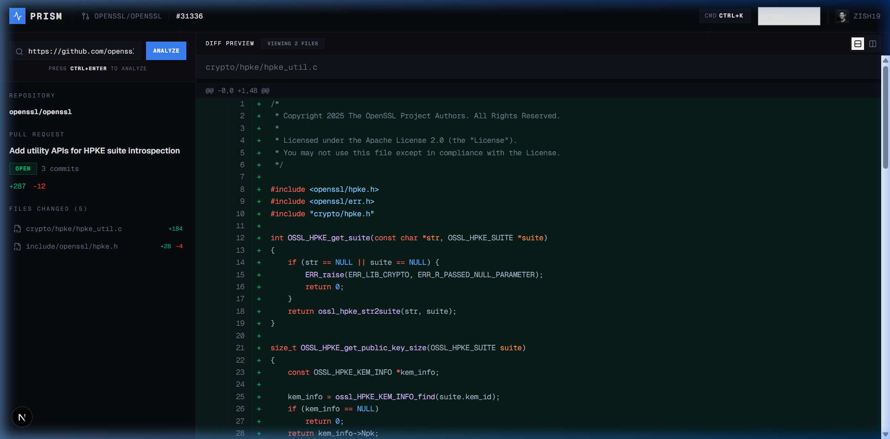
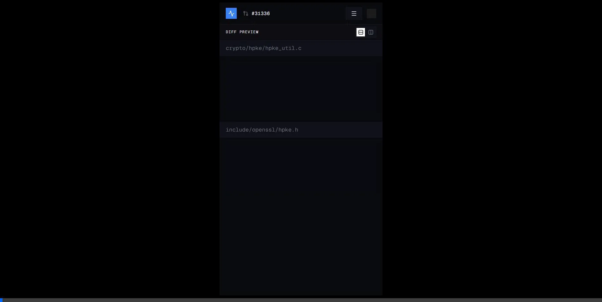

# PRISM 
## Autonomous Pull Request Intelligence System

<div align="center">
  
</div>

PRISM is a high-performance, automated intelligence engine designed to intercept, analyze, and score GitHub pull requests in real-time. It acts as an autonomous senior engineer, executing static analysis across four critical dimensions: Security, Performance, Architecture, and Quality. Encased in a brutalist, typography-driven interface, PRISM provides immediate, uncompromised feedback on code changes.

---

## The Dashboard Experience

<div align="center">
  
</div>

PRISM rejects the conventional, overly-softened corporate aesthetic. It embraces a brutalist design language defined by sharp edges, high-contrast typography, and explicit grid structures. 

---

## Architecture & Stack

PRISM is engineered for speed, utilizing a modern edge-ready web stack.

- **Core Framework**: Next.js 16 (App Router) with Turbopack
- **Styling**: Tailwind CSS v4 featuring a custom Brutalist Design System
- **Animation Engine**: Framer Motion for 60FPS hardware-accelerated micro-interactions
- **Physics Engine**: Matter.js for custom interactive DOM elements
- **Syntax Analysis**: Shiki for granular tokenization and diff rendering
- **Authentication**: Clerk for secure, stateless user session management
- **Component Primitives**: Radix UI for unstyled, accessible component foundations

---

## The Intelligence Engine

At the core of PRISM lies a deterministic, highly-tuned heuristic analysis pipeline. It evaluates pull requests instantly without relying on slow external inference APIs. The system is split into four discrete engines:

### Security Engine
Identifies attack vectors and cryptographic mishandling before they merge into production.
- Detects hardcoded secrets, API keys, and AWS credentials
- Flags unsafe dynamic execution patterns (eval, setTimeout)
- Identifies naive string concatenation leading to injection vulnerabilities
- Detects leaked JWT tokens within source control

### Performance Engine
Analyzes cyclomatic complexity and runtime inefficiencies.
- Detects O(N^2) complexity via heavily nested iteration
- Identifies N+1 query patterns and network calls inside loops
- Flags blocking synchronous operations

### Architecture Engine
Enforces structural integrity and long-term maintainability.
- Analyzes function cyclomatic depth and nesting levels
- Detects monolithic files exceeding standard threshold limits
- Identifies violations of the Single Responsibility Principle

### Quality Engine
Ensures adherence to enterprise-grade code cleanliness standards.
- Flags residual debugging artifacts and console statements
- Detects unresolved architectural debt (TODO, FIXME, HACK)
- Identifies the use of the `any` type in TypeScript environments
- Flags single-letter variable declarations and commented-out dead code

---

## Core Interface

The PRISM dashboard provides an uncompromising, data-dense command center.

- **Global Command Palette**: Instantly navigable via `CTRL+K` (or `CMD+K`).
- **Interactive Diff Viewer**: Real-time split or unified diff visualization with precise line-level syntax highlighting.
- **Metrics Telemetry Panel**: A comprehensive statistical breakdown of the AI review, including severity distribution and an overarching Merge Probability index.
- **Report Exporters**: Single-click generation of Markdown and JSON analysis reports for seamless integration into external workflows.
- **Interactive Physics Topology**: A custom Matter.js integration on the landing page simulating unconstrained 2D rigid body physics for dynamic aesthetic presentation.

---

## Deployment & Setup

Ensure a local environment with Node.js 20+ and pnpm.

### 1. Initialization

```bash
git clone https://github.com/Zish19/prism-ai-pr-analyzer.git
cd prism-ai-pr-analyzer
pnpm install
```

### 2. Environment Configuration

Create a `.env.local` file in the root directory. You must supply your Clerk keys and an optional GitHub Personal Access Token to expand rate limits.

```env
NEXT_PUBLIC_CLERK_PUBLISHABLE_KEY=pk_test_...
CLERK_SECRET_KEY=sk_test_...

# Optional: Increase GitHub API Rate Limits
GITHUB_TOKEN=ghp_...
```

### 3. Execution

Launch the Turbopack development server:

```bash
pnpm dev
```

Navigate to `http://localhost:3000` to access the console.

---

## Design Philosophy

PRISM rejects the conventional, overly-softened corporate aesthetic. It embraces a brutalist design language defined by sharp edges, high-contrast typography, and explicit grid structures. 

The interface is built to communicate raw data efficiently, honoring the precision required in software engineering. With seamless support for both a high-contrast Dark Mode and an engineered Cream Light Mode, PRISM ensures maximum legibility across any technical environment.

---

## Phase 8 / Future Roadmap

The current iteration of PRISM relies on fast heuristic processing. Future upgrades will address known architectural constraints:

1. **AST & Tree-Sitter Integration**
   - *Current Limitation*: Regex heuristics lack deep syntax understanding.
   - *Phase 8 Upgrade*: Implementing AST parsing to unlock true architectural analysis.
2. **Context-Aware Repository Scanning**
   - *Current Limitation*: Diff-only analysis lacks unchanged context, risking false positives.
   - *Phase 8 Upgrade*: Expanding analysis scopes beyond the patch to evaluate full module impact.
3. **LLM Reasoning Layer**
   - *Current Limitation*: Heuristics flag issues but cannot explain *why* or offer complex architectural refactoring.
   - *Phase 8 Upgrade*: Pipeline heuristics directly into an LLM layer for deep contextual explanation and automated remediation.

---
*Architected by the PRISM Engineering Group. 2026.*
